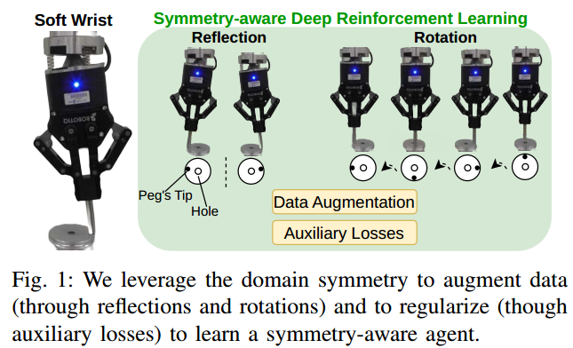
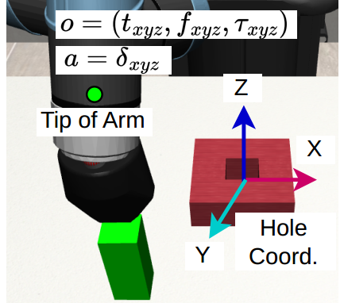
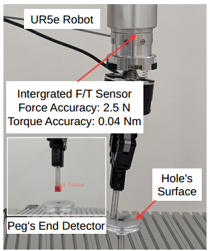

## Symmetry-aware Reinforcement Learning for Robotic Assembly under Partial Observability with a Soft Wrist

[Arvix Paper](https://arxiv.org/abs/2402.18002) | [Submission Video](https://www.youtube.com/watch?v=XU4Sbt_NnT8)

<div style="display: flex; justify-content: center;">
  <figure style="margin-right: 20px;">
    
  </figure>
  <figure style="margin-right: 20px;">
    
    <figcaption>Simulated Soft Wrist in MuJoCo</figcaption>
  </figure>
  <figure>
    
    <figcaption>Real Soft Wrist</figcaption>
  </figure>
</div>

## Setup
1. Install [anaconda](https://docs.conda.io/projects/conda/en/latest/user-guide/install/)
2. Create and activate environment
```
conda create --name symm_pomdp python=3.8.16
conda activate symm_pomdp
```
3. Clone this repository and install required packages
```
git clone https://github.com/hai-h-nguyen/symmetry-aware-pomdps.git
pip install -r requirements.txt
```
4. Install [PyTorch](https://pytorch.org/get-started/previous-versions/) (we used 1.12.0 for cuda 10.2 but other versions should work)
```
conda install pytorch==1.12.0 torchvision==0.13.0 torchaudio==0.12.0 cudatoolkit=10.2 -c pytorch
```
5. Install submodules
```
cd robotsuite
pip install -r requirements.txt
pip install -e .
cd ..
cd pomdp-domains
pip install -e .
cd ..
```

---

## Train

```
export PYTHONPATH=${PWD}:$PYTHONPATH

# RSAC-Normal:
python3 policies/main.py --cfg configs/peg_insertion/rnn.yml --env PegInsertion-Square-XYZ-v0 --seed 0 --cuda 0

# SAC-Obs:
python3 policies/main.py --cfg configs/peg_insertion/mlp.yml --env PegInsertion-Square-XYZ-v0 --seed 0 --cuda 0

# RSAC-Aug:
python3 policies/main.py --cfg configs/peg_insertion/rnn.yml --env PegInsertion-Square-XYZ-v0 --seed 0 --cuda 0 --group_name FlipXY --actor_type aug --critic_type aug

# RSAC-Aug-Aux:
python3 policies/main.py --cfg configs/peg_insertion/rnn.yml --env PegInsertion-Square-XYZ-v0 --seed 0 --cuda 0 --group_name FlipRotXY4 --actor_type aug-aux --critic_type aug-aux

# RSAC-Equi:
python3 policies/main.py --cfg configs/peg_insertion/rnn.yml --env PegInsertion-Square-XYZ-v0 --seed 0 --cuda 0 --group_name FlipXY --actor_type equi --critic_type equi

# SAC-State:
python3 policies/main.py --cfg configs/peg_insertion/mlp.yml --env PegInsertion-Square-State-XYZ-v0 --seed 0 --cuda 0

```

## Simulate a Trained Policy
```
python3 policies/main.py --cfg configs/peg_insertion/rnn.yml --env PegInsertion-Square-XYZ-v0 --group_name FlipRotXY4 --actor_type aug-aux --critic_type aug-aux --replay --policy_dir policy.pt
```

## Peg & Hole Design File
```
See peg_and_hole_designs.f3d (AutoDesk project file), from which, mesh files for pegs and holes can be exported
```

